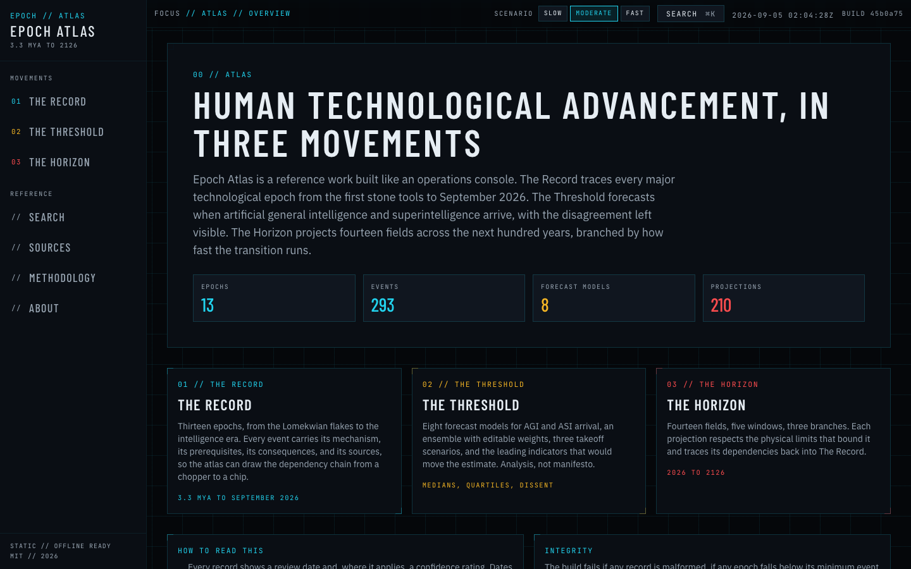
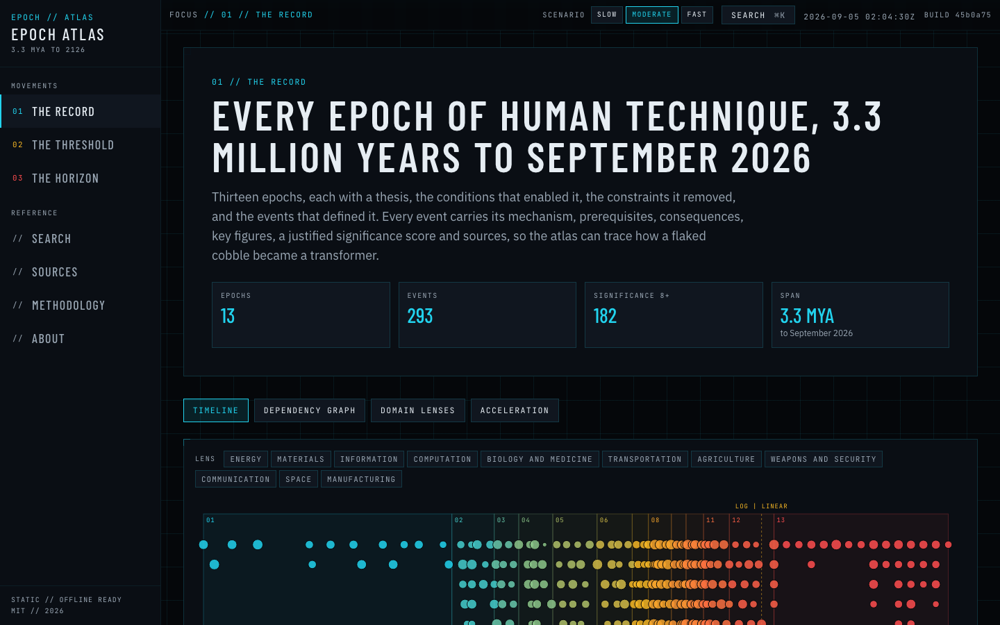
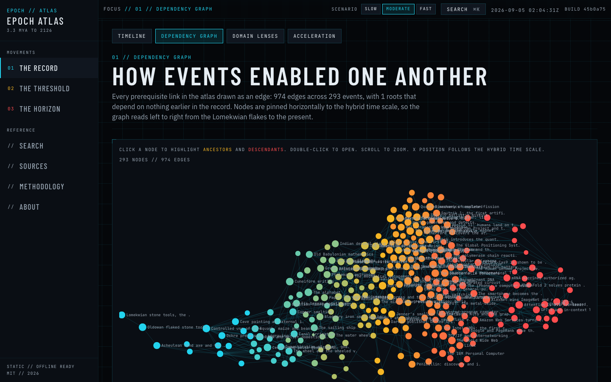
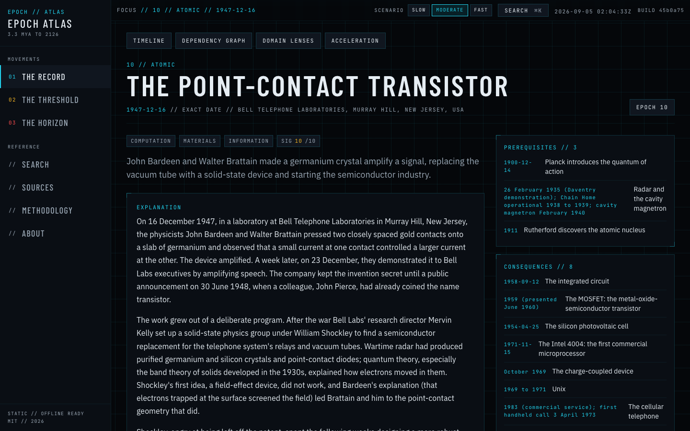
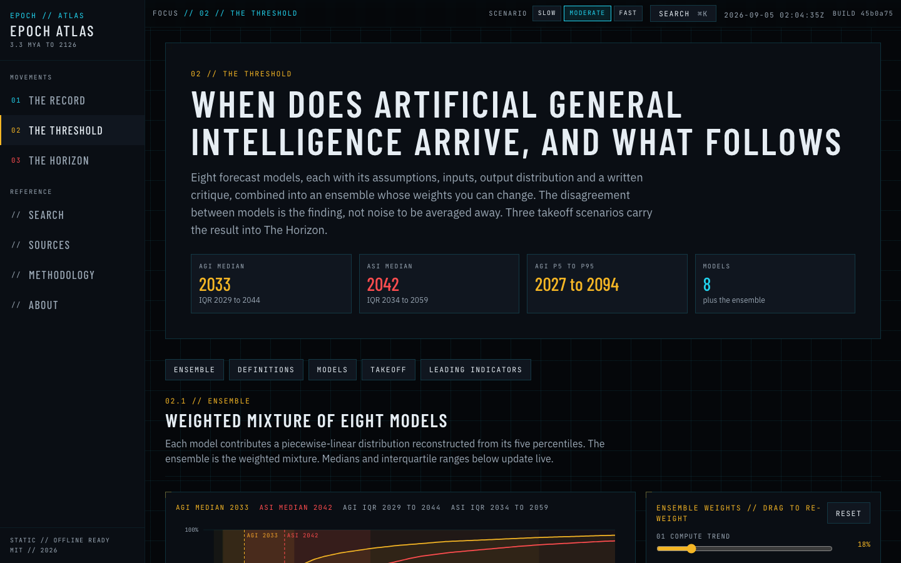
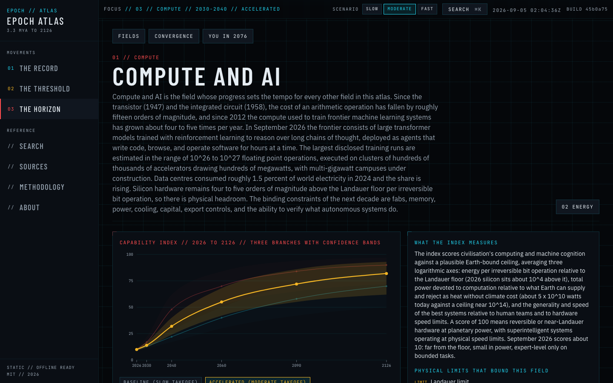

# Epoch Atlas

**Live site: https://akapc.github.io/epoch-atlas/**

An interactive atlas of human technological advancement in three movements, built as a serious reference work with the visual identity of a classified operations console.

1. **The Record**: thirteen epochs and every major technological event from the first stone tools (3.3 million years ago) to September 2026, each with its mechanism, prerequisites, consequences, key figures, a justified significance score and sources. A master timeline (logarithmic deep past, linear recent), a dependency graph, eleven domain lenses and an acceleration panel computed from the atlas itself.
2. **The Threshold**: eight typed forecast models for AGI and ASI arrival, an ensemble with editable weights that re-renders live, three takeoff scenarios, definitions with steelmen, and the leading indicators that would move the estimate.
3. **The Horizon**: fourteen fields projected across five windows (2026 to 2126) and three branches pinned to the takeoff scenarios, with fan charts, a convergence view, a global scenario selector and a lifespan panel. Physical limits are cited where they bound a projection.

Static site. No backend, no database, no API keys. Works offline after first load.

## Screenshots

| Home | Master timeline |
| --- | --- |
|  |  |

| Dependency graph | Event record |
| --- | --- |
|  |  |

| The Threshold | Horizon field |
| --- | --- |
|  |  |

## Local development

```bash
npm ci
npx playwright install chromium
npm run dev
```

Quality gates, all of which run in CI on every push to `main`:

```bash
npm run lint        # ESLint: typescript-eslint, react-hooks, jsx-a11y
npm run typecheck   # tsc --noEmit, strict
npm run test        # Vitest: schema validity and content-completeness gates
npm run build       # validates data, builds the search index, builds the site, copies 404.html
npm run e2e         # Playwright: every route, search, scenario reflow, weight drag, axe on five pages
npx lhci autorun    # Lighthouse thresholds: performance 90, accessibility 100, best practices 95, SEO 95
```

## Data model

All content is typed data under `src/data`, validated with Zod at build time (`src/data/schema.ts`).

- `Epoch`: id, index, name, code, year range, thesis, enabling conditions, constraints removed, second-order consequences, transition, what changed for a human being, minimum event count, sources.
- `TechEvent`: id, epoch id, date (astronomical year, optional month and day, precision flag, display string), location, title, summary, 300 to 600 word explanation, mechanism, prerequisites and consequences (event ids), figures, significance 1 to 10 with justification, domains, sources, review date, confidence, verification flag.
- `ForecastModel`: assumptions, inputs, AGI and ASI percentiles (p5 to p95), reasoning, critique, default ensemble weight, sources.
- `TakeoffScenario`, `LeadingIndicator`, `Definition`.
- `HorizonField`: summary, index definition, physical limits, 15 `Projection` records (5 windows x 3 branches), capability index per scenario, sources.
- `Projection`: headline, 200 to 400 word narrative, dependencies (event ids), uncertainties, indicators, confidence with justification, sources.
- `Convergence`: fields, mechanism, expected decade per scenario, dependencies, sources.

Years are signed integers on the astronomical scale (negative for BCE). Ids are kebab-case. Every fact-bearing record carries `sources` and `lastReviewed`. The canonical event id registry is in `docs/EVENT_IDS.md`.

## Adding an event or a projection

See `CONTRIBUTING.md`. In short: add the record to the epoch or field file, run the per-file checker (`npx tsx scripts/check-epoch.ts <file>` or `npx tsx scripts/check-field.ts <file>`), then `npm run test`. The gates check word counts, id resolution, window and branch coverage, forbidden strings and schema shape.

## Documentation

- `docs/ARCHITECTURE.md`: stack, folder layout, data flow, build pipeline.
- `docs/METHODOLOGY.md`: the forecasting approach, failure modes, track record.
- `docs/DECISIONS.md`: every autonomous decision made during the build.
- `docs/CITATION_GAPS.md`: citations flagged as less than fully verified.

## License

MIT. See `LICENSE`.
